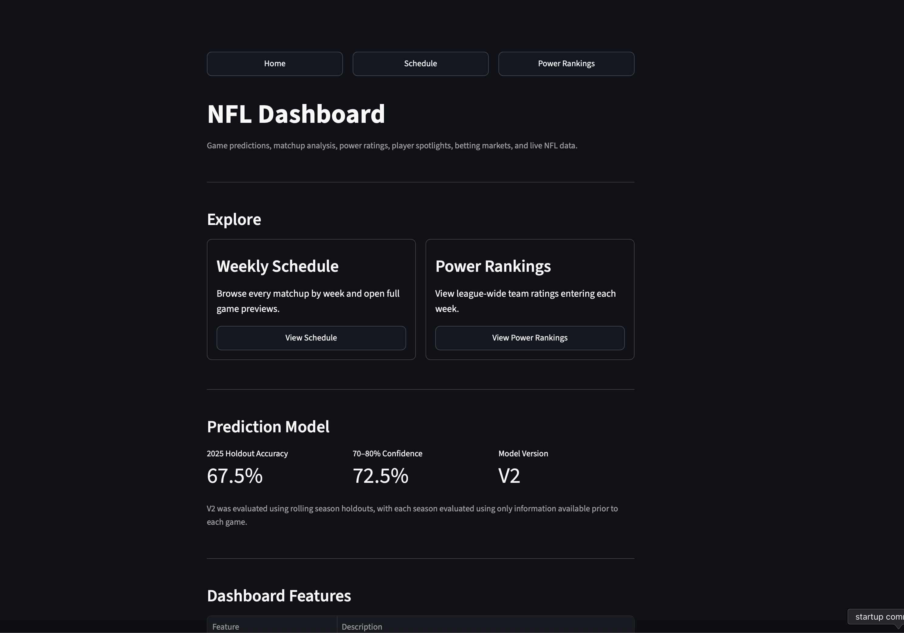
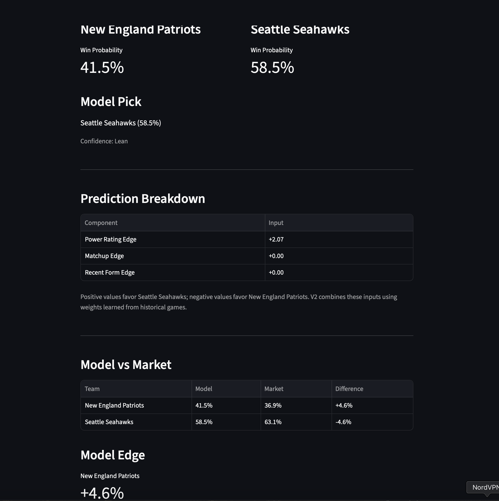
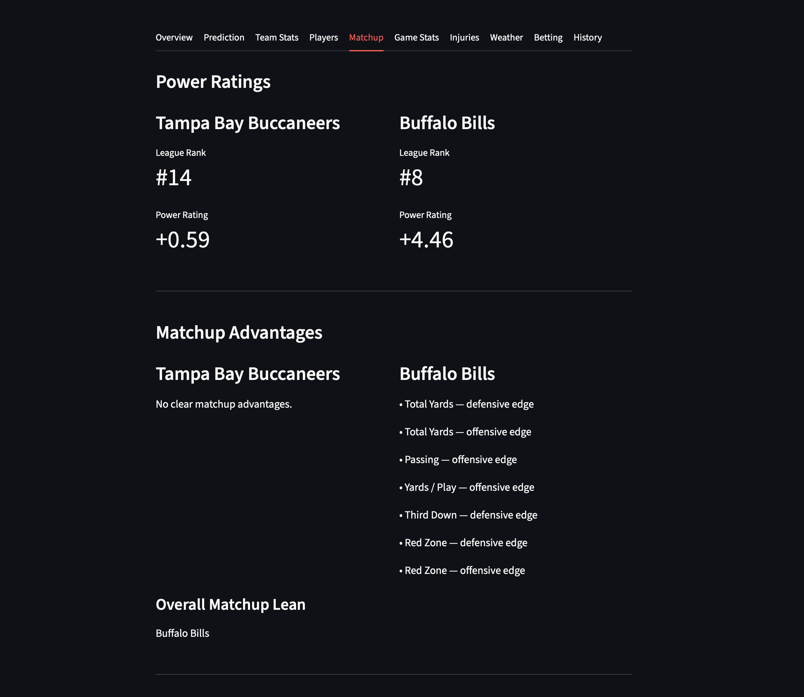
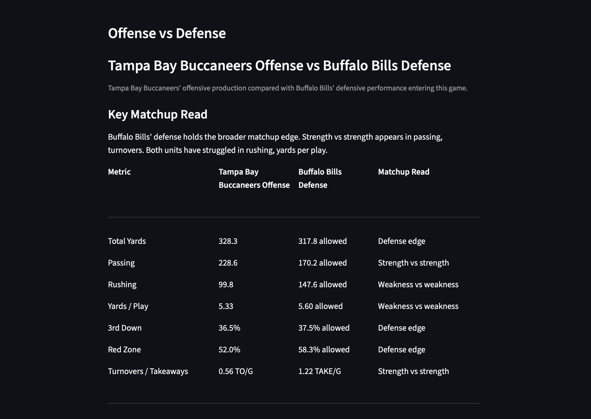
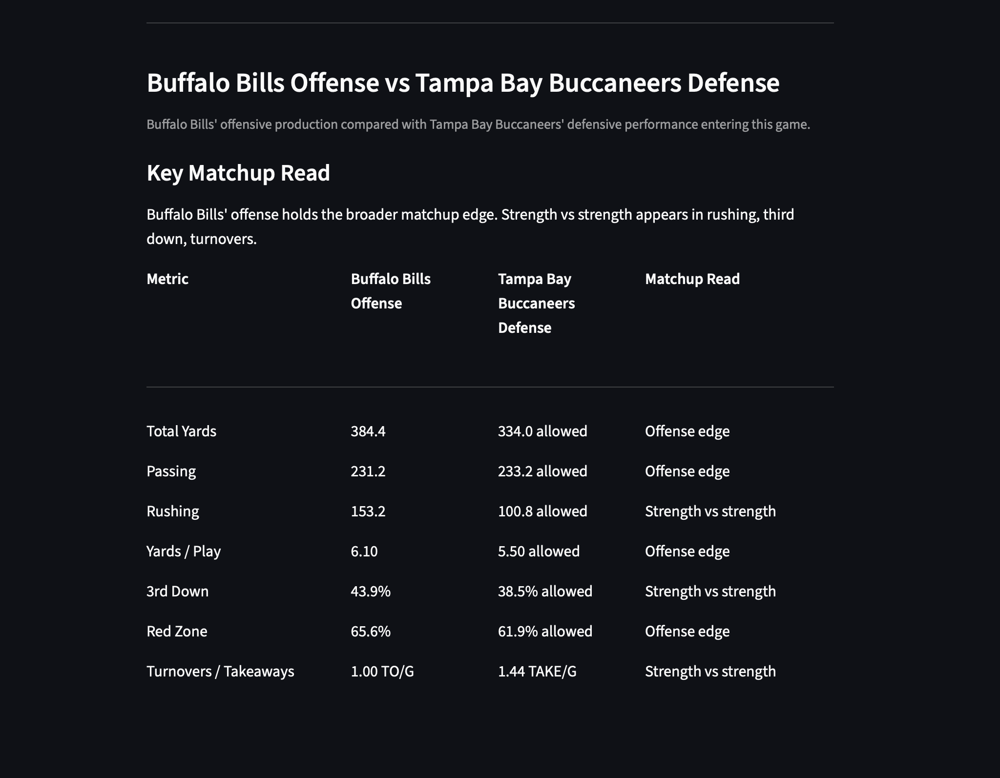
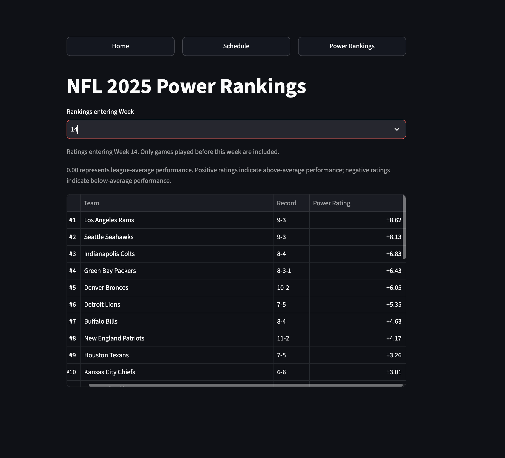

# NFL Analytics Dashboard

An end-to-end NFL analytics application built with Python, PostgreSQL, and Streamlit.

The project collects and stores NFL data, transforms it into team and player analytics, and presents schedules, game details, matchup analysis, power rankings, injuries, weather, betting information, and probabilistic game predictions through an interactive dashboard.

## Dashboard Preview

### Home



### Game Prediction



### Matchup Analysis







### Power Rankings



## Features

- Multi-season NFL schedule and game results
- Team records and recent form
- Offensive and defensive team statistics
- Player statistics and depth charts
- Key-player spotlights
- Matchup advantages
- Game box scores
- Injury tracking
- Weather information
- Betting market information
- Team power rankings
- Probabilistic game predictions
- Historical prediction backtesting

## Architecture

The application is organized into four primary modules:

- `app.py` — Streamlit application flow and page orchestration
- `data.py` — PostgreSQL queries and data retrieval
- `analytics.py` — prediction, matchup, power-rating, and analytical logic
- `components.py` — reusable Streamlit presentation components

Supporting scripts handle data ingestion, model training, calibration, and historical backtesting. This separation keeps database access, analytical logic, presentation code, and application orchestration independently maintainable.

## Data Pipeline

The project uses a PostgreSQL-backed data pipeline to maintain historical and current NFL data used throughout the dashboard.

The pipeline:

1. Extracts NFL schedule, game, team, and player data from ESPN data sources.
2. Transforms API responses into structured records for analysis.
3. Loads normalized data into PostgreSQL.
4. Builds historical team and player profiles from stored game data.
5. Generates matchup, recent-form, power-rating, and prediction features.
6. Serves the resulting data and analytics through the Streamlit application.

Historical calculations use game dates as temporal cutoffs so that analytics for a given matchup are based only on information available before that game.

## Prediction Model

The game prediction system combines three primary signals:

- **Power edge** — relative team strength derived from scoring margin, yards per play, turnovers, third-down efficiency, and red-zone efficiency
- **Matchup edge** — offense-versus-defense comparisons across key statistical categories
- **Recent-form edge** — performance over each team's three most recent games

A logistic regression model converts these features into home and away win probabilities.

Early in a season, current-season statistics are blended with the previous season to reduce instability from small samples. The previous-season contribution decreases as current-season games are played.

### Temporal Integrity

Historical features are calculated using only games completed before the game being predicted.

Team profiles, league baselines, recent form, and opponent information use the historical game's kickoff date as a cutoff, preventing the predicted game's result or later games from entering its feature set.

### Rolling Holdout Validation

Model performance was evaluated using season-level rolling holdouts. Each test season was predicted using a model trained only on earlier seasons.

| Test Season | Training Games | Test Games | Accuracy | Brier Score | Log Loss |
|---|---:|---:|---:|---:|---:|
| 2023 | 269 | 272 | 59.2% | 0.2396 | 0.6719 |
| 2024 | 541 | 272 | 64.0% | 0.2216 | 0.6338 |
| 2025 | 813 | 271 | 67.5% | 0.2167 | 0.6233 |

The production model is subsequently refit on all eligible historical training data so that future predictions can use the full available sample.

### Probability Calibration

Across the full historical backtest, higher predicted confidence corresponded with higher observed win rates:

| Predicted Confidence | Games | Average Prediction | Observed Win Rate |
|---|---:|---:|---:|
| 50–60% | 490 | 54.8% | 54.5% |
| 60–70% | 359 | 64.8% | 66.3% |
| 70–80% | 190 | 74.3% | 72.1% |
| 80–90% | 47 | 82.2% | 83.0% |

The full historical probability set produced a Brier score of `0.2260`, compared with `0.2500` for a 50/50 baseline and `0.2478` for a constant historical home-win-rate baseline.

## Tech Stack

- Python
- PostgreSQL
- Streamlit
- pandas
- scikit-learn
- psycopg2
- ESPN data sources

## Project Structure

```text
sports-data-pipeline/
├── app.py
├── analytics.py
├── components.py
├── data.py
├── backtest_predictions.py
├── train_prediction_model.py
├── calibrate_predictions.py
└── README.md
```

## Running Locally

### Prerequisites

- Python 3.13+
- PostgreSQL
- A local Python virtual environment

### Installation

Clone the repository and enter the project directory:

```bash
git clone <repository-url>
cd sports-data-pipeline
```

Create and activate a virtual environment:

```bash
python -m venv .venv
source .venv/bin/activate
```

Install dependencies:

```bash
pip install -r requirements.txt
```

### Database

The application expects a local PostgreSQL database containing the NFL schedule, team, player, betting, injury, weather, and supporting analytical data.

The repository includes ingestion scripts for the major data domains, including:

- `load_historical_games.py`
- `load_team_game_stats.py`
- `load_player_game_stats.py`
- `load_rosters.py`
- `load_depth_charts.py`
- `load_injuries.py`
- `load_weather.py`
- `load_betting.py`
- `load_venue_coordinates.py`

Database credentials are currently configured for the local development environment, so they should be updated or externalized before deployment.

### Run the Dashboard

With PostgreSQL running and the database populated:

```bash
streamlit run app.py
```

Streamlit will start the application locally, typically at:

```text
http://localhost:8501
```

### Model Evaluation

Historical prediction performance can be regenerated with:

```bash
python backtest_predictions.py
```

Model training and rolling season holdout evaluation can be run with:

```bash
python train_prediction_model.py
```